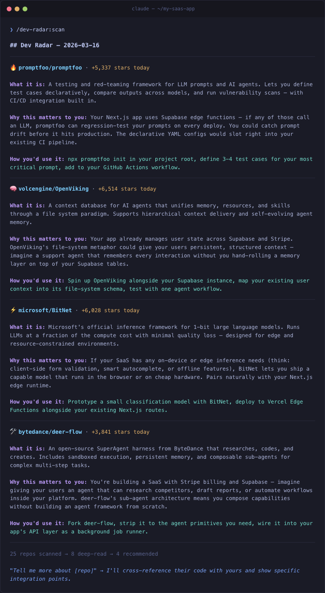

# dev-radar

**Stop doomscrolling GitHub trending. Get the 5 repos that actually matter to you.**

[](LICENSE)
[](https://docs.anthropic.com/en/docs/claude-code)
[](https://python.org)

dev-radar is a [Claude Code](https://docs.anthropic.com/en/docs/claude-code) plugin that scans GitHub trending repos and scores them against *your* workspace — your dependencies, your CLAUDE.md, your git history, your active projects. Instead of 25 random trending repos, you get 4-6 ranked recommendations with specific, creative insights about how each one connects to what you're actually building.

Zero API keys. Zero config. Zero pip install. Just `/scan`.

<p align="center">
  
</p>

## Install

Two commands inside Claude Code:

```
/plugin marketplace add imsthegenius/dev-radar
/plugin install dev-radar
```

Then run your first scan:

```
/dev-radar:scan
```

That's it. No API keys, no pip install — Python 3.8+ stdlib only.

<details>
<summary><strong>Manual install</strong> (for development or inspection)</summary>

```bash
git clone https://github.com/imsthegenius/dev-radar.git ~/dev-radar
claude --plugin-dir ~/dev-radar/plugin
```

</details>

## Usage

```
/dev-radar:scan                              # Weekly trending (default)
/dev-radar:scan --daily                      # Daily trending
/dev-radar:scan --languages=python,rust      # Filter by language
/dev-radar:scan --monthly                    # Monthly trending
```

After the scan, say **"tell me more about [repo]"** — it reads the repo's source code, cross-references it with your local files, and produces a concrete integration plan with files to change, effort estimate, and gotchas.

## What makes this different

Most "trending" tools just list repos. dev-radar reads your workspace and thinks creatively about connections:

```
Without dev-radar:
"You use PostgreSQL, so this PostgreSQL tool could be useful."

With dev-radar:
"This repo implements real-time data sync between edge functions and a DB.
Your dashboard currently does full page refreshes — you could use this pattern
to make it feel instant, with records updating live as your scraper finds new
entries."
```

It's the difference between a list and a consultant.

## How it works

1. **Fetches trending repos** — scrapes github.com/trending (falls back to GitHub Search API automatically)
2. **Reads your workspace** — CLAUDE.md, package.json / requirements.txt / Cargo.toml, git history, memory
3. **Triages ~25 → ~8-10** — quick relevance filter based on your tech stack and domain
4. **Deep-reads shortlisted repos** — fetches and actually reads each README (not just the tagline)
5. **Scores creatively** — consulting-grade analysis connecting each repo to your actual work
6. **Presents 4-6 rich recommendations** — what it is, why it matters to *you*, how you'd start

Results are cached for 4 hours. Second scans are instant.

## Architecture

```
plugin/
├── .claude-plugin/plugin.json       # Plugin manifest
├── commands/scan.md                 # /scan slash command
├── skills/dev-radar/SKILL.md        # Core intelligence (scoring + presentation)
├── scripts/github_trending.py       # Scrapes trending → JSON (stdlib only)
└── scripts/lib/
    ├── http.py                      # HTTP client with retry + backoff
    └── cache.py                     # 4-hour TTL file cache
```

Python handles the mechanical data fetching (HTTP, HTML parsing, caching). Claude handles the intelligence (reading your workspace, scoring relevance, suggesting integrations).

## Contributing

PRs welcome. The main areas to improve:

- **Parser resilience** — GitHub changes their trending page HTML periodically. The API fallback kicks in automatically, but fixing the parser is better.
- **More workspace signals** — currently reads CLAUDE.md, deps, git log, and memory. Could also read CI config, Dockerfile, etc.
- **Output quality** — the SKILL.md scoring examples drive recommendation quality. Better examples = better recs.

## License

MIT
